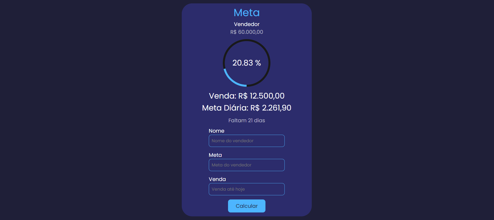

<p align="center">
  
</p>

## Projeto

O aplicativo consiste em receber a meta de vendas a ser atingida até o final do mês. A pessoa informa a meta atual e o valor das vendas realizadas até o momento, e o aplicativo retorna a porcentagem de progresso em relação à meta, além de calcular quantos dias restam no mês em questão e qual a meta diária necessária para alcançá-la.

## Tecnologias

- [React](https://pt-br.reactjs.org/)
- [Vite](https://vitejs.dev/)
- [Typescript](https://www.typescriptlang.org/)
- [Styled-components](https://styled-components.com/)

## Instalação

Para instalar o projeto, basta clonar o repositório e instalar as dependências utilizando o gerenciador de pacotes `npm` ou `yarn`.
```shell
$ git clone https://github.com/srandersondev/target-calculator.git
$ cd target-calculator
$ npm install
```
ou
```shell
$ git clone https://github.com/srandersondev/target-calculator.git
$ cd target-calculator
$ yarn install
```
Após a instalação das dependências, inicie o servidor de desenvolvimento com o comando:
```shell
$ npm run dev
```
ou
```shell
$ yarn dev
```
## Contribuições

Se você gostaria de contribuir para o Target-calculator, sinta-se à vontade para abrir um problema ou enviar uma solicitação de pull request. Qualquer ajuda é bem-vinda!
